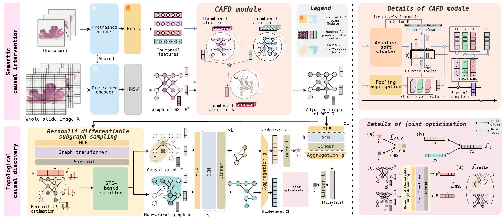

# C$^2$MIL: Dual-Causal Graph-Based MIL for Survival Analysis

[](https://arxiv.org/abs/xxx)  
[](https://github.com/mimic0127/C2MIL)  
[](#license)

Official PyTorch implementation of $C^2$MIL, a **dual-causal graph-based multiple instance learning (MIL) model** designed for **robust and interpretable survival analysis** on whole slide images (WSIs).

---

## 🔍 Overview

Graph-based MIL is widely used in computational pathology but faces two key challenges:

1. **Semantic Confounding Bias**  
   Variations in staining, sectioning, and scanning introduce irrelevant features that harm generalization.

2. **Topological Noise**  
   Not all subgraphs in WSIs are causally relevant to survival outcomes, leading to biased representations.

To tackle these, we propose **C2MIL**, which synchronizes **semantic and topological causalities** via a dual structural causal model.

<p align="center">
  
</p>

---

## ✨ Key Features

- **Cross-Scale Adaptive Feature Disentangling (CAFD):**  
  Removes trivial semantic confounders via backdoor adjustment, adaptively learning confounders without prior knowledge.

- **Bernoulli Differentiable Subgraph Sampling:**  
  Identifies causal subgraphs within WSIs using a straight-through estimator for robust topology learning.

- **Joint Optimization:**  
  Combines semantic supervision and topological contrastive learning under causal invariance.

- **Generalizable & Interpretable:**  
  Achieves **state-of-the-art survival prediction** while providing interpretable attention heatmaps and adaptive clustering.

---

## 📊 Performance

C2MIL achieves **state-of-the-art C-index** across three TCGA cohorts with significant improvements in both cross-validation and out-of-distribution generalization.

| Model      | KIRC  | ESCA  | BLCA  |
|------------|-------|-------|-------|
| ABMIL      | 0.679 | 0.639 | 0.577 |
| PatchGCN   | 0.686 | 0.652 | 0.576 |
| ProtoSurv  | 0.698 | 0.619 | 0.593 |
| **C2MIL**  | **0.708** | **0.690** | **0.608** |

---

## ⚙️ Installation

```bash
git clone https://github.com/mimic0127/C2MIL.git
cd C2MIL
conda create -n c2mil python=3.9
conda activate c2mil
pip install -r requirements.txt
````

Dependencies:

---

## 🚀 Usage

### 1. Feature Extraction

Extract patch and thumbnail features using a pretrained backbone (e.g., UNI, ViT, ctranspath).

### 2. Graph Construction

Construct patch-level graphs with KNN using patch coordinates.

### 3. Training

```bash

```

### 4. Evaluation

```bash

```

---

## 📂 Repository Structure


---

## 📜 Citation

If you find this repository useful, please cite our paper:

```bibtex

```

---


## 📝 License

This project is licensed under the MIT License.

